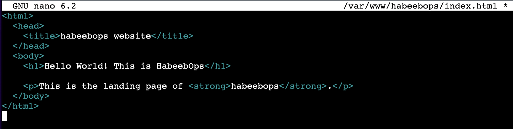

# How To Install Linux, NginX, MySQL, PHP (LEMP) Stack on Ubuntu 22.04
## Step 1 - Installing NginX and Updating the firewall
Start by updating the package manager cache. If this is the first time you’re using sudo within this session, you’ll be prompted to provide your user’s password to confirm you have the right privileges to manage system packages with apt:

`sudo apt update`

Then, install Nginx with:

`sudo apt install nginx`

You’ll be prompted to confirm Nginx’s installation. Confirm by pressing Y, then ENTER.

Once the installation is finished, you’ll need to adjust your firewall settings to allow HTTP traffic. Ubuntu’s default firewall configuration tool is called Uncomplicated Firewall (UFW). To list all currently available UFW application profiles, execute this command:

`sudo ufw app list`

To only allow traffic on port 80, use the Nginx profile:

`sudo ufw allow 'Nginx HTTP'`

Verify the change with:

`sudo ufw status`

If you get status: inactive as output, run:

`sudo ufw enable`

then run

`sudo ufw status`

**Output**

Traffic on port 80 is now allowed through the firewall.

Check to verify that everything works by visiting your server’s public IP address in your web browser:

http://13.51.45.28

Below is the Nginx default web page:

## Step 2 — Installing MySQL
Now that Nginx web server up and running, a database system needs to be installed to store and manage data for your site. MySQL is a popular database management system used within PHP environments.

To start, use apt to acquire and install this software:

`sudo apt install mysql-server`

When prompted, confirm installation by typing Y, and then ENTER.

When the installation is finished, it’s recommended that you run a security script that comes pre-installed with MySQL. This script will remove some insecure default settings and lock down access to your database system.

`sudo mysql_secure_installation`

When prompted, confirm installation by typing Y, and then ENTER to series of question regarding removal of anonymous user and test database.

**Output**

## Step 3 — Installing PHP

Having installed Nginx to serve content and MySQL to store and manage data, PHP is next component of which processes code to display dynamic content to the end user. Nginx requires an external program to handle PHP processing and act as a bridge between the PHP interpreter itself and the web server. This allows for better overall performance in most PHP-based websites, but it requires additional configuration. You’ll need to install php8.1-fpm, which stands for “PHP fastCGI process manager” and uses the current version of PHP, to tell Nginx to pass PHP requests to this software for processing.  In addition to the php package, we will install php-mysql, a PHP module that allows PHP to communicate with MySQL-based databases and also install libapache2-mod-php to enable Apache to handle PHP files.

To install these packages, run the following command:

`sudo apt install php8.1-fpm php-mysql`

Once the installation is finished, run the following command to confirm your PHP version:

`php -v`

**Output**

LAMP stack is now fully operational, but before testing the setup with a PHP script, it’s best to set up a proper Apache Virtual Host to hold your website’s files and folders.

## Step 4 — Configuring Nginx to Use the PHP Processor

When using the Nginx web server, you can create server blocks to encapsulate configuration details and host more than one domain from a single server. we’ll set up a domain called habeebops.

Nginx on Ubuntu 22.04 has one server block enabled by default that is configured to serve documents from the /var/www/html directory. While this works well for a single site, it can become difficult to manage if you are hosting multiple sites. Instead of modifying /var/www/html, we’ll create a directory structure within /var/www for the habeebops site, leaving /var/www/html in place as the default directory to be served if a client request doesn’t match any other sites.

Create the directory for habeeb ops domain as follows:

`sudo mkdir /var/www/habeebops`

Next, assign ownership of the directory with the $USER environment variable, which will reference your current system user:

`sudo chown -R $USER:$USER /var/www/habeebops`

Then, open a new configuration file in Nginx’s sites-available directory using your preferred command-line editor. Here, we’ll use nano:

`sudo nano /etc/nginx/sites-available/habeebops`

This will create a new blank file. Add in the following bare-bones configuration with your own domain name: 

Save and close the file when you’re done. If you’re using nano, do that by pressing CTRL+X, then Y and ENTER.

Activate your configuration by linking to the configuration file from Nginx’s sites-enabled directory:

`sudo ln -s /etc/nginx/sites-available/habeebops /etc/nginx/sites-enabled/`

Then, unlink the default configuration file from the /sites-enabled/ directory:

`sudo unlink /etc/nginx/sites-enabled/default`

To test your configuration for syntax errors by running the following:

`sudo nginx -t`

Finally, reload Nginx so these changes take effect:

`sudo systemctl reload nginx`

Your new website is now active, but the web root /var/www/habeebops is still empty. Create an index.html file in that location to test that the server block works as expected:

`nano /var/www/habeebops/index.html`

Enter the below and save

Go to your browser and access your server’s domain name or IP address:

http://13.51.45.28

Your web page should reflect the contents in the file you just edited:

## Step 5 — Testing PHP with Nginx

Now that you have a custom location to host your website’s files and folders, create a PHP test script to confirm that Nginx is able to handle and process requests for PHP files.

Create a new file named info.php inside your custom web root folder:

`nano /var/www/habeebops/info.php`

This will open a blank file. Add the following text, which is valid PHP code, inside the file:

When you are finished, save and close the file.

To test this script, go to your web browser and access your server’s domain name or IP address, followed by the script name, which in this case is info.php:

http://13.51.45.28/info.php

Here is an example of the default PHP web page:

